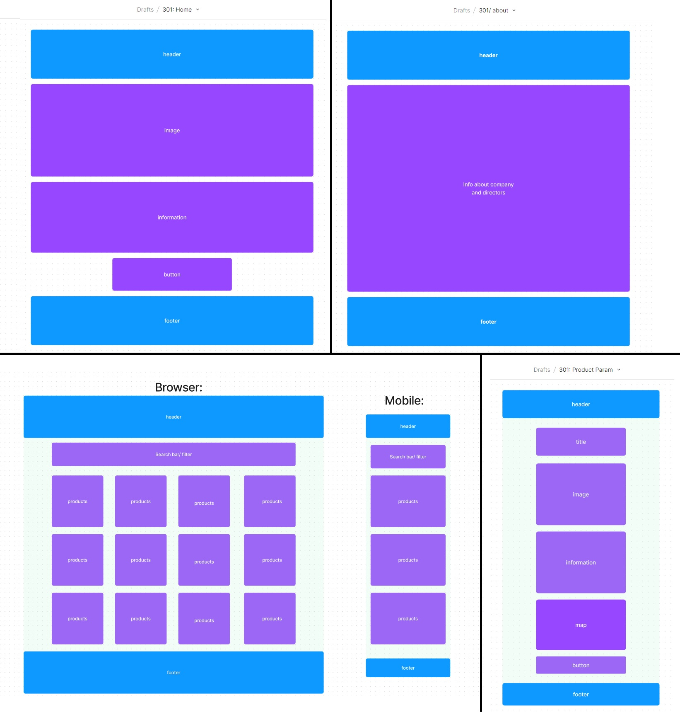

The overall problem domain and how the project solves those problems
Semantic versioning, beginning with version 1.0.0 and incremented as changes are made
A list of any libraries, frameworks, or packages that your application requires in order to properly function
Instructions that the user may need to follow in order to get your application up and running on their own computer
Clearly defined API endpoints with sample responses
Clearly defined database schemas
Activity

# Gift Traders

**Author**: Frances Hitchcock and Katy Ledgard
**Version**: 1.0.0 (increment the patch/fix version number if you make more commits past your first submission)

## Overview// A description of the project

This project is part of the Tech Educators Full-Stack MERN Bootcamp.

### The overall problem domain and how the project solves those problems

GiftTraders Ltd has an idea for a reuse website where users can upload their unwanted items. Users can also find items they need and claim them. They initially want a Home page, an About Us page, a Products page and an Administrators page.

On the home page, they would like information about the company and it’s environmental impact and ethos. They would like a donate button that opens a form in a modal where a user can add their unwanted item. This item will then be added to the database and rendered onto the products page.

On the about page, they would like information about the company and it’s directors.

They would like a products page which renders the items being donated, with the option to filter categories. The rendered product will show a product name and image. When a user clicks on the image, it will take the user to the product page which contains the product name, the image, a description, a static map of the approximate location. It will contain a button to say the item has been collected – removing it from the site.

They would like an administrators page where the site administrators can log in to update any products as necessary.

### User Stories

**As a user who is donating, I want a form that is easy to use to fill out information about the details and location for the item I am giving away.**

1.

**As a user, I want to have a page that renders all the products. I want to be able to filter products by category or name.**

1.

**As a user, I want to be able to click on a product and get more details about this product, including a static map for the approximate location.**

1.

**As a user, I want to learn more about the company and it’s directors.**

1.

**As a user, I want to be able to visit a homepage and learn about how the site works. I want to be able to upload an item from the homepage.**

1.

**As a user, I want to be able to claim an item. I would like a confirmation that I can collect the item with a collection address.**

1.

## Getting Started

<!-- What are the steps that a user must take in order to build this app on their own machine and get it running? -->
<!-- Instructions that the user may need to follow in order to get your application up and running on their own computer -->

- Download the code from Github
- Use npm i to install packages in your server and client
-

## Architecture

<!-- Provide a detailed description of the application design. What technologies (languages, libraries, etc) you're using, and any other relevant design information. -->
<!-- A list of any libraries, frameworks, or packages that your application requires in order to properly function -->

- MongoDB
- Mongoose
- Express
- Body Parser
- Cors
- Axios

<!--
Clearly defined API endpoints with sample responses

Clearly defined database schemas

Activity -->

## Planning

### React Structure

.jpg>)

### Wireframes

#### Project Scope

##### Minimum Viable Product

The website will consist of a Home page, an About Us page, a Products page and an Administrators page. There will also be a page where a single product will be rendered with additional detail for the user to inspect and select if required.

The home page will have information about the company and its environmental impact and ethos. It will include a donate button that opens a form in a modal where a user can add their unwanted item. This item will then be added to the database and rendered onto the products page.

The about page will have information about the company and its directors.

The products page will render the items being donated, with the option to filter categories. The rendered product will show a product name and image and a visual indication of its condition. When a user clicks on the product, it will take the user to the product page which contains the product name, the image, a description, and a static map of the approximate location. It will contain button to say the item is reserved – removing it from the site.

The administrators page will allow administrators to log in to update any products as necessary.

##### Stretch Goals

Add some products to home page.

Add the facility for a product to be classified as reserved, with a Boolean value in the product object. The collector will then be able to reserve it then remove it from the database when it has been collected.
